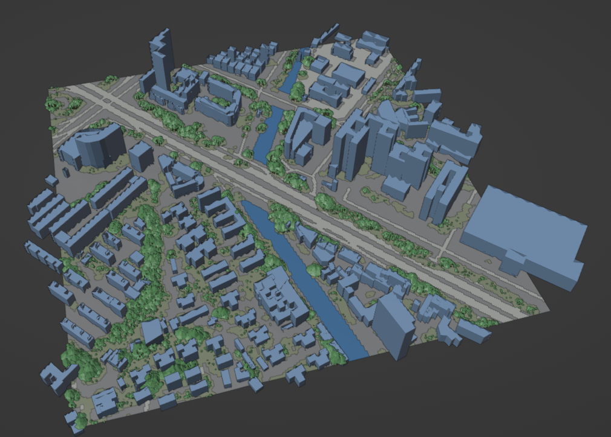

# Generate-3DCity-Pipeline

[](https://www.python.org/)
[](https://qgis.org/)
[](https://www.blender.org/)
[](https://developer.nvidia.com/sionna)
[](#-license--acknowledgements)

**A robust, automated framework bridging the gap between geospatial data and high-fidelity electromagnetic simulations.**

This pipeline automates the generation of photorealistic 3D city scenes by integrating **OpenStreetMap (OSM)** and **Google Earth Engine (GEE)** data. It seamlessly orchestrates **QGIS** for footprint extraction and **Blender** for scene composition, producing assets optimized for **Mitsuba 3** rendering and **NVIDIA Sionna** ray tracing simulations.

> **Note:** This project is an evolution of the [VoxCity](https://github.com/kunifujiwara/VoxCity) library, enhanced with automated pipelines for EM simulation workflows.

---

## 📸 Visual Results

<div align="center">
  
  
  <p>
    <em>Figure 1: Raw geometry generated directly from OSM footprints and GEE data.</em>
  </p>
</div>

---

## 🎬 Pipeline Demo

<div align="center">
  
  
  <p>
    <em>End-to-end generation: Transforming raw OSM & GEE data into a high-fidelity 3D scene in Blender.</em>
  </p>
</div>

---

## 🌟 Key Features

* **⚡ Automated Workflow**: End-to-end automation—from raw data acquisition to final 3D model generation—with a single batch command.
* **🌍 Multi-Source Fusion**: Intelligently combines 2D building footprints from OSM with terrain and vegetation height data from GEE.
* **📐 High Precision**: Leverages QGIS algorithms to ensure accurate building footprint extraction and geometry.
* **📡 Sionna Ready**: Designed for 6G research; generates scenes with material properties ready for NVIDIA Sionna radio propagation simulations.
* **🎨 Semantic Segmentation**: Automatically segments terrain (e.g., Water, Wet/Dry ground) for realistic electromagnetic interaction modeling.

---

## 🛠️ System Prerequisites

Ensure your **Windows** environment meets the following requirements before installation.

| Software | Version Required | Note |
| :--- | :--- | :--- |
| **QGIS** | `3.40.11` or later | [Download MSI](https://download.qgis.org/downloads/QGIS-OSGeo4W-3.40.11-1.msi) <br> *⚠️ Ensure **Python API** is selected during installation.* |
| **Blender** | `3.6 LTS` or later | [Download MSI](https://www.blender.org/download/release/Blender3.6/blender-3.6.23-windows-x64.msi) |
| **Mitsuba Add-on** | Latest | [Repo & Guide](https://github.com/mitsuba-renderer/mitsuba-blender) <br> *Must be installed inside Blender.* |
| **GEE Account** | Active | Required for fetching DEM (Elevation) and canopy data. |

---

## 📦 Installation & Setup

### 1. Python Environment
Create a dedicated Conda environment and install geospatial/mesh dependencies:

```bash
conda create --name G3DC python=3.12
conda activate G3DC

# Install Geospatial dependencies (via conda-forge for binary stability)
conda install -c conda-forge gdal timezonefinder

# Install Core Python packages
pip install voxcity
pip install rasterio==1.3.11
pip install triangle mapbox-earcut manifold3d
```
### 2. Google Earth Engine Authentication
Authenticate to allow the script to download terrain data via the GEE API.

1.  Open `ee_register.ipynb` in Jupyter Notebook.
2.  Execute the authentication cell:
    ```python
    !earthengine authenticate --auth_mode=notebook
    ```
3.  Follow the link, generate the token, and verify.

### 3. Project Configuration

**A. Set Earth Engine Project ID**
Open `vox.py` and assign your GEE Project ID:
```python
# vox.py
EE_PROJECT_ID = "your-project-id"  # <--- Update this
```

**B. Configure Local Paths**
Edit `run_batch.bat` to point to your local QGIS and Blender executables:
```bat
:: run_batch.bat
:: ================= CONFIGURATION =================
set "QGIS_ROOT=D:\Programs\QGIS 3.40.11"
set "PYQGIS_BAT=%QGIS_ROOT%\bin\python-qgis-ltr.bat"
set "BLENDER_EXE=D:\Blender Foundation\Blender 3.6\blender.exe"
:: =================================================
```

---

## 📥 Data Setup

Due to GitHub file size limits, the required shapefile datasets are hosted externally.

1. **Download the Data:**
   * [**Download local_shp.zip (Google Drive)**](https://drive.google.com/file/d/1BswWni2APeU-7P0tZIrt6O6AT9ubJj2a/view?usp=sharing)

2. **Install:**
   Extract the zip file into the project root directory. Your folder structure should look like this:

   ```text
   Generate-3DCity-Pipeline/
   ├── dataset/
   ├── docs/
   ├── local_shp/       <-- Extract here (Ensure it contains subfolders c/, g/, etc.)
   ├── run_batch.bat
   └── ...
   ```
---

## 🚀 Usage Guide

### 1. Quick Start
To start the generation process with default settings:

```powershell
.\run_batch.bat
```
*Follow the on-screen prompts to specify the number of scenes (rounds) to generate.*

### 2. Customization
You can control *where* and *how* the city is generated by modifying the scripts below.

#### 📍 Select Target City (`roi.py`)
Modify the argument passed to `roi.py` inside `run_batch.bat` (e.g., `python roi.py 0`).

| ID | City Name | Region |
| :---: | :--- | :--- |
| **0** | Shenzhen | South China |
| **1** | Chongqing | Southwest China |
| **2** | Chengdu | Southwest China |
| **3** | Suzhou | East China |
| **4** | Hangzhou | East China |
| **5** | Hefei | East China |

#### 📏 Adjust Region Size (`roi.py`)
Define the physical dimensions of the generated tile:
```python
# roi.py
width = 600   # Meters
height = 600  # Meters
```

#### 🎲 Mesh Resolution (`vox.py`)
To adjust voxel size or raw data source, refer to the [VoxCity Documentation](https://voxcity.readthedocs.io/en/latest/index.html) and modify parameters within `vox.py`.

### 3. Simulation Integration
Once generated, the scene is ready for ray tracing.
* **Tutorial**: Open `load_scene.ipynb`.
* **Action**: Follow the steps to load the `.xml` scene into a Sionna context.

---

## 📂 Output Directory Structure

Results are automatically organized in the `dataset/` folder:

```plaintext
dataset/
├── scene_0/
│   ├── mitsuba_export/         # 🟢 FINAL ASSETS (Renderer Ready)
│   │   ├── meshes/             # .ply geometry files
│   │   └── scene.xml           # Main Mitsuba scene file
│   │
│   ├── outputs/                # 🟡 RAW DATA (Intermediate)
│   │   ├── building.geojson    # Vector footprints
│   │   ├── dem.tif             # Digital Elevation Model
│   │   ├── land_cover.tif      # Surface classification
│   │   └── ...                 # Numpy arrays for processing
│   │
│   ├── scene.glb               # 🔵 PREVIEW (Standard 3D Viewer)
│   ├── city_roi.json           # Metadata (Coordinates/Bounds)
│   └── tmp.geojson             # Debug/Temp data
└── ...
```

---

## 📜 License & Acknowledgements

* **Pipeline Architecture**: Developed by **Garvin Z.**
* **VoxCity_custom Core Logic**: Built upon the **VoxCity** library.

> *Please respect the licenses of the underlying libraries (VoxCity, Google EarthEngine) when distributing assets generated by this pipeline.*
